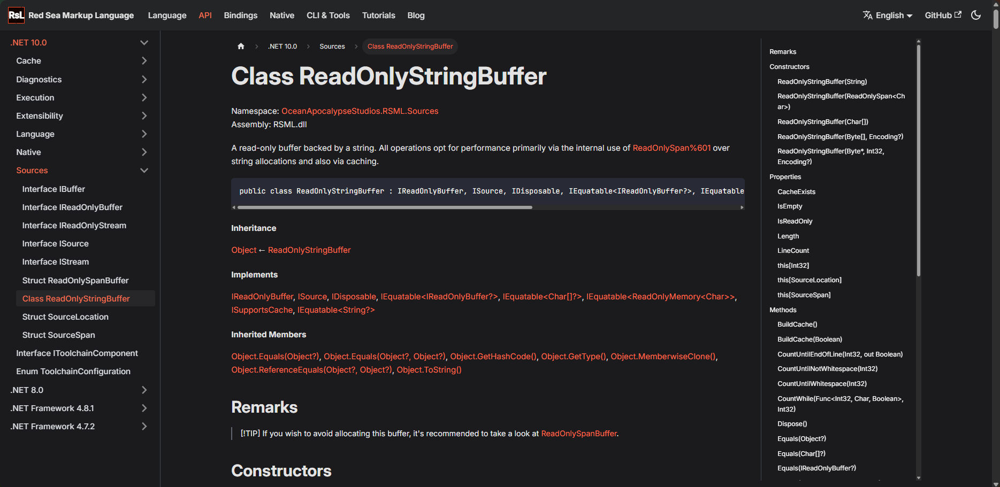

It hasn't been long since I wrote [the devlog](/blog/hello-docfx) announcing the new site for RSML documentation. Well, consider it obsolete nonetheless, because we have moved to Docusaurus!

In this article, I'll explain why this change was considered and ultimately decided on. I should probably warn you, though: it's going to be a long article!

{/* truncate */}

## The state of DocFX
As of writing this article, [DocFX](https://dotnet.github.io/docfx) is hosted under Microsoft's .NET project yet seems to receive little to no attention. Microsoft clearly uses a different - internal only - tool for their massive API browser inside Microsoft Learn. It's the only way to explain why DocFX seems to be so "behind" in all of its features: how could it ever be what Microsoft is actually using if it lacks the basic features you can see in Microsoft Learn's API browser?

In a [video](https://learn.microsoft.com/en-us/shows/on-dotnet/intro-to-docfx) part of Microsoft's On .NET series, Hot Reload support for DocFX is mentioned, yet, as this [issue](https://github.com/dotnet/docfx/issues/2297) makes clear, barely nothing was done regarding it.

Another feature we considered essential yet was not present in DocFX was organizing exports for multiple target frameworks. Of course it allows us to export for multiple frameworks, but as for organizing said exports? No. If you just use DocFX and export to `api/net10.0`, `api/net8.0` and whatnot, you'll find UIDs clash, because DocFX does not take into account the possibility of the same namespace (in different frameworks) being included in the documentation more than one time.

### What about DocFX alternatives?
There aren't any real alternatives to DocFX. There are quite a few open-source CLI tools that output Markdown documentation from .NET assemblies, but I found those either lacked features (such as not recognizing C# 14 extension members, which we use in RSML) or their output was not organized enough.

This led to us moving away from DocFX as the static site generator, and using it only for the exportation ability (`docfx metadata`), which is also slightly broken in its own way, but it's objectively better than nothing.

## Our move to Docusaurus
We moved to Docusaurus, as it provided a lot of useful features with very simple setup. We could easily set up documentation versioning and even support for languages other than English.

Using it seemed effortless until we reached the multimillion-dollar question: "what about RSML's API reference?"

So what was the issue? Well, DocFX is greedy! Let me explain: DocFX is made for DocFX. When you export an API reference with DocFX, it exports it expecting DocFX itself to use it to generate the site. This means exports are filled with things Docusaurus does not, in any way, understand. Here are two major examples:
* Anchors in headings
* Backslash-escaping

We tried multiple things, but eventually settled for a sanitization script (which is currently private, as it's still being cleaned up) that runs before exporting the API reference with DocFX.

### The sidebar issue
At the time, Docusaurus was auto-generating the sidebar. Well, DocFX actually just exports everything in the same directory with no organization whatsoever: the Docusaurus sidebar was an absolute mess because of this.

We quickly put together some small, somewhat messy, functions that allowed DocFX to generate an actual organized and pretty sidebar. This sadly took quite some time, all thanks to a tool that seems to be barely supported nowadays.

## The final result

---

Despite the major difficulties setting everything up, we have to say the site looks extremely clean now. Docusaurus does provide a refreshing and modern UI for the static sites it generates.

With the project in development after a short break, and the documentation finally picking up, we believe RSML has a shiny future ahead of it.
